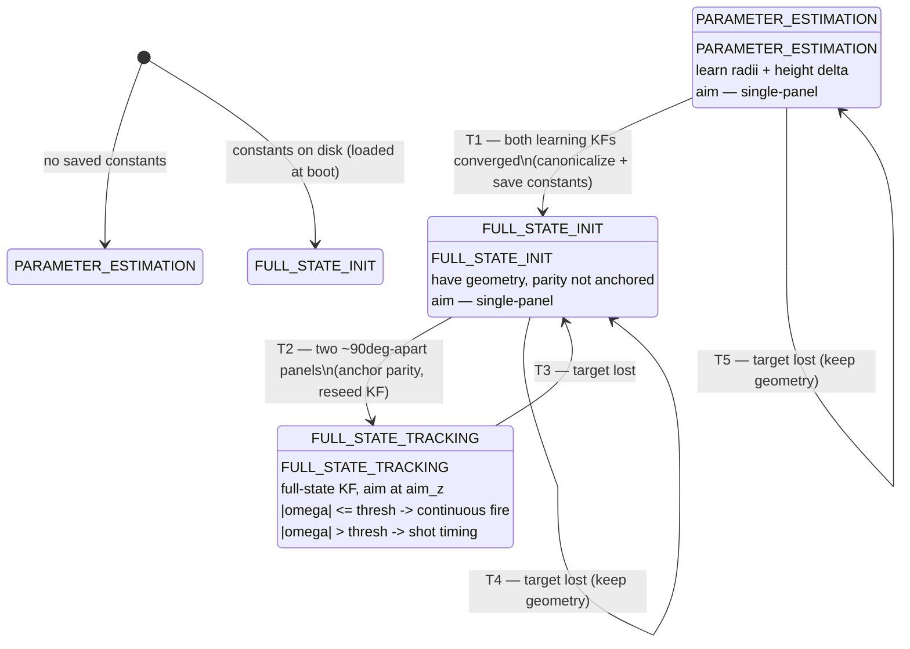

# The full-state auto-aim engine

`src/engines/full_state_autoaim.py` (`FullStateAutoAimEngine`) is the production
auto-aim engine. It's the largest, most important engine in the repo and the best
real example of everything in {doc}`intro`: it owns a context, a stack of modules,
two drivers (camera + MCU), and a per-robot **state machine** that decides which
modules and which ballistics run each frame.

This page is a high-level map. The authoritative detail is the long module
docstring at the top of the engine file — read it alongside this.

## What it's trying to do

Hit a spinning enemy robot. A RoboMaster robot has armor panels arranged around a
center, and the robot spins, so to put a shot on a panel you need to know the
robot's **full kinematic state** — center position, velocity, spin angle, and
spin rate — plus its **geometry** (how far each panel sits from center, and the
height offset between panel pairs).

The hard part: that geometry differs per robot and isn't known up front. So the
engine **learns each robot's constants online**, saves them to disk, and reuses
them on later runs. Until it has them, it falls back to a simpler aiming mode that
needs no geometry.

## The per-robot state machine

The engine keeps **one state per enemy-robot name** (`sentry`, `hero`,
`standard`). All transition logic lives in the engine itself — the modules know
nothing about states. The states are in the `AimState` enum:

```{list-table}
:header-rows: 1
:widths: 22 38 40

* - State
  - What it's doing
  - How it aims (which ballistics)
* - **PARAMETER_ESTIMATION**
  - No saved constants for this robot yet. Runs the full-state KF with a guessed
    radius so panels can be tracked, and learns the real per-parity orbit radii
    (`RadiiEstimatorModule`) and the inter-pair height delta
    (`PanelHeightDeltaModule`).
  - **Single-panel** — aims directly at the closest panel's *measured* position,
    no robot geometry required.
* - **FULL_STATE_INIT**
  - Constants exist (loaded from disk or just learned), but panel-id *parity*
    isn't anchored to the current visual track yet. ("Panel 0" from a past
    session is meaningless against a fresh track.)
  - **Single-panel** — same safe fallback, until two panels let it anchor.
* - **FULL_STATE_TRACKING**
  - Fully anchored. The full-state KF estimates center/velocity/spin; panel
    tracking keeps ids stable so even single-panel frames pick the right
    back-projection radius.
  - **Full-state** — `aim_z` mid-height between panel pairs, and the ballistic
    module is chosen by spin rate (see below).
```

### State diagram

T6 isn't drawn as an edge below — it can fire from *any* state: when the targeted
robot *name* changes, the engine swaps in that robot's saved state, and a robot in
`FULL_STATE_TRACKING` demotes to `FULL_STATE_INIT`.



### Transitions (summary)

- **T1** `PARAMETER_ESTIMATION → FULL_STATE_INIT`: both learning KFs converged
  (variance under config thresholds + enough updates) ⇒ canonicalize the
  constants and save them to the `JsonStore`.
- **T2** `FULL_STATE_INIT → FULL_STATE_TRACKING`: two ~90°-apart panels are
  visible ⇒ anchor saved radii onto the live panel parity (by the relative height
  of the two panels), re-seed the KF.
- **T3** `FULL_STATE_TRACKING → FULL_STATE_INIT`: target lost (ids are
  track-relative, so parity must be re-anchored).
- **T4 / T5** (self-loops): target lost in INIT / PARAMETER_ESTIMATION — reset the
  track-bound filters but **keep** learned geometry (it's static).
- **T6** (any state): the targeted robot *name* changes — swap in that robot's
  per-robot state; a TRACKING robot demotes to FULL_STATE_INIT.

The takeaway: **track-bound state** (the spin-angle track, panel ids, the
full/single-panel KFs) is fragile and resets on any loss or switch; **geometry**
(radii, height delta) is static and persists across losses and across runs.

## Why there are three ballistics modules ("which states fire how")

There are three ballistic modules in `src/subsystems/ballistics/`, each solving a
different version of the aiming problem. The engine picks one per frame based on
the aim state and the spin rate. They all output a `ctx.solution`; an out-of-range
solution carries `is_confident=False`, which forwards pitch/yaw to keep the turret
on target but reports `NO_TARGET` so firmware holds fire.

```{list-table}
:header-rows: 1
:widths: 26 30 44

* - Ballistic module
  - Used in
  - Why it exists
* - **`SinglePanelBallisticModule`**
  - PARAMETER_ESTIMATION, FULL_STATE_INIT
  - The safe fallback. Aims straight at one tracked panel using its *actual
    measured z* and a constant-velocity xy estimate — **no robot geometry
    needed**. This is what lets the engine aim usefully *before* it has learned a
    robot's constants, or while parity is unanchored.
* - **`FullStateContinuousFireModule`**
  - FULL_STATE_TRACKING when `|omega| ≤ omega_spin_threshold`
  - Slow / non-spinning target. A panel is in front of the shooter long enough to
    just keep firing, so it solves yaw/pitch toward the predicted panel position
    at impact time and lets firmware fire freely.
* - **`FullStateShotTimingModule`**
  - FULL_STATE_TRACKING when `|omega| > omega_spin_threshold`
  - Fast-spinning target. No panel stays in front long enough for continuous
    fire, so this computes both the aim **and an alignment time** — *when* a panel
    will next face the shooter — and tells firmware to wait and fire then. It aims
    at the panel on the robot's circumference (`d − r_mean`), not the center, so
    the shot doesn't fly high.
```

The spin-rate split happens in `_run_full_state_tracking`: it reads `|omega|` from
the estimate and compares against `config.ballistic.omega_spin_threshold` (3.0
rad/s). Below it, continuous fire; above it, shot timing.

### `CVState`: what the firmware is told

Separate from the *aim* state machine, the engine reports a `CVState` to the MCU
each tick (`src/subsystems/embedded_communicator.py`) — this is how the **firmware
decides whether to pull the trigger**:

- `NO_TARGET (0)` — no usable target, or an unconfident (out-of-range) solution ⇒
  hold fire (but still track).
- `CONTINUOUS_FIRE (2)` — slow/no spin ⇒ fire freely.
- `SHOT_TIMING (1)` — fast spin ⇒ wait for the reported alignment time, then fire.

So "which ballistics ran" maps directly onto "what the firmware does with the
trigger."

## The main loop, briefly

`execute()` runs as fast as it can, capped at `config.autoaim.loop_hz`:

1. **Frame or coast.** If the `CameraDriver` has a new frame (fresh `seq`), run the
   full vision pipeline (`_process_frame`); otherwise just predict the estimator
   forward and re-send, so ballistic angles keep flowing between camera frames.
2. **`_process_frame`** does: detection → drop non-finite poses → classification →
   sticky target selection (`_select_target`) → ask the MCU for the camera→turret
   transform and rotate panel poses into the turret/ballistic frame.
3. **Dispatch** to the active state's pipeline (`_run_parameter_estimation` /
   `_run_full_state_init` / `_run_full_state_tracking`), which decides which
   modules and ballistics run.
4. **`_publish_solution`** stages `ctx.solution`; `update()` sends it to the MCU
   via the shared `McuDriver` and services the display.

Two things worth knowing:

- **Sticky targeting.** `_select_target` keeps the locked robot and only switches
  when a *different* robot is dramatically closer, or the lock times out
  (`target_reset_timeout_ms`). While the lock's panels are briefly missing it
  coasts on the remembered robot (predict-only), which is why there are two FPS
  tallies in the logs: fresh-observation ticks vs. predict/re-send ticks.
- **Ownership.** The engine owns *everything* stateful: the state machine, all disk
  I/O for constants, MCU I/O, frame pacing, the target-lost timeout, and which
  `module.run()` calls happen each tick. Modules receive what they need via
  explicit setters at transition time — they never read config/disk/state
  themselves. That's a deliberate design choice: it keeps the modules reusable and
  the (complex) control flow in exactly one place.

## How it's launched

It declares `drivers = {"frames": CameraDriver, "mcu": McuDriver}`, so it must go
through the orchestrator (not constructed + `.start()`ed directly):

```python
from src.core.orchestrator import launch_system
processes = launch_system([FullStateAutoAimEngine])
```

`launch_system` spawns one shared process per driver and wires the handles in
(`src/core/orchestrator.py`). The MCU backend (mock / serial / ROS) and camera are
chosen by the `MCU=` and `CAMERA=` profiles — the engine never opens hardware
itself.

```{note}
**Currently** `orchestrator.start_engines()` hardcodes `FullStateAutoAimEngine`.
Choosing a *different* auto-aim or auto-nav engine still means a code change.
Making that a config/profile selection (with `src/core/factory.py` registering the
swappable engines) is one of the planned directions noted in {doc}`intro`.
```
