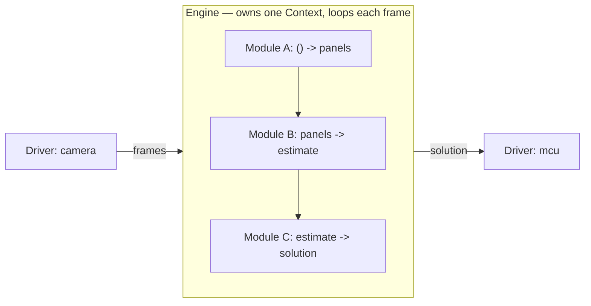

# Core concepts

This page is the 10-minute mental model for AutoX. Read it before anything else.
If you want to *build* something right after, jump to the {doc}`tutorial` — it
walks you through a tiny working engine from scratch.

AutoX is a framework for running and managing several cooperating processes on a
robot. The whole point of the framework is that you can describe a feature as a
small pipeline of swappable steps, and run a **mock** version of the entire thing
(no camera, no GPU, no turret) just by flipping a config flag.

There are four nouns you'll see everywhere. Learn these and most of the codebase
reads itself.

## The four nouns

### Context — the shared clipboard

A **Context** is a plain Python `@dataclass` that holds named values for one
pipeline, e.g. `panels`, `estimate`, `solution`. Think of it as a clipboard every
step can read from and write to. It lives in `src/core/module.py` (the base
`Context`) and concrete contexts live in `src/types/` (e.g. `AutoAimContext`).

```python
from dataclasses import dataclass
from typing import Optional
from src.core.module import Context

@dataclass
class AutoAimContext(Context):
    panels: Optional[list] = None
    target_panel: Optional[object] = None
```

More detail: {doc}`context`.

### Module — one step of the pipeline

A **Module** is the smallest reusable unit of work. It declares up front *"I read
these named values (`inputs`) and I write these named values (`outputs`)"* and
then does one focused thing. It does **not** know what produced its inputs or what
will read its outputs — it only touches the context by name.

```python
class DoublerModule(Module[CounterContext]):
    def __init__(self, context):
        super().__init__(name="doubler", context=context,
                         inputs=["number"], outputs=["doubled"])

    @real()
    def _run(self, number):
        return number * 2
```

`inputs`/`outputs` are just **strings** that must match field names on the
context. More detail: {doc}`module`.

### Engine — the thing that actually runs

An **Engine** owns one context and an ordered list of modules, and runs them in a
loop. It is the process-level unit of work: the base `Engine`
(`src/core/engine.py`) subclasses `multiprocessing.Process`, so **each engine runs
as its own OS process**. You implement two methods:

- `initialize()` — one-time setup, runs **inside the child process**
- `execute()` — one iteration of work, called repeatedly

More detail: {doc}`engine`.

### Driver — shared ownership of one piece of hardware

A **Driver** (`src/core/driver.py`, concrete ones in `src/drivers/`) wraps a piece
of hardware that **only one process may own** — a camera, the MCU/serial link.
Several engines might all need camera frames, but only one process can hold the
device open, so a driver runs as its own process and hands out client handles to
whoever asks. An engine declares the drivers it needs with a class attribute:

```python
class MyEngine(Engine[MyContext]):
    drivers = {"frames": CameraDriver, "mcu": McuDriver}
```

```{note}
The driver abstraction is newer and still settling — the source itself says it's
"kinda just playing around with this abstraction." Engines that declare `drivers`
**must** be launched through `launch_system` (see below), not constructed and
`.start()`ed directly.
```

## How a module runs: the `@real` / `@mock` split

This is the feature the whole framework is built around. Every module can carry
two implementations of its work:

- `@real(...)` — the production version (uses the real camera/GPU/hardware)
- `@mock` — the simulated version (returns canned data)

The base class picks which one to call based on a single config flag,
`config.mock.enable`. Engines only ever call `module.run()`, so **no call site
changes** when you switch the whole system between real and mock. That's what lets
you run the full pipeline on a laptop with nothing plugged in.

```python
class DetectorModule(Module[AutoAimContext]):
    @real(requires="camera")
    def _run_real(self):
        ...                       # grab a frame, detect panels
        return panels

    @mock
    def _run_mock(self):
        return [fake_panel()]     # deterministic, no hardware
```

```{note}
`requires="camera"` on a `@real` method is **recorded but not yet acted on** — see
"Current state vs. future direction" below.
```

## Configuration and profiles

Almost every tunable number (camera resolution, gravity, projectile speed, which
backend to use, whether to mock) lives in **`src/info.yaml`**, not hardcoded in
Python. Read it in code through a dict-like object:

```python
from src.toolbox.globals import config
print(config.ballistic.gravity)   # 981
print(config.mock.enable)         # False
```

`info.yaml` has a `(default)` block that's always loaded, plus named **profile**
blocks under `(profiles)` that get merged on top when you select them with an `@`
on the command line:

```sh
uv run main.py @CAMERA=WEBCAM @MCU=SERIAL
```

Real profiles that exist today include `BOARD=LAPTOP` / `BOARD=XAVIER` (laptop vs.
Jetson), `CAMERA=WEBCAM` / `CAMERA=REALSENSE` / `CAMERA=NONE`, `MCU=MOCK` /
`MCU=SERIAL` / `MCU=ROS`, and `GPU=NONE` / `GPU=TENSOR_RT`. If you select nothing,
the defaults (set in `src/toolbox/globals.py`) are `GPU=NONE BOARD=LAPTOP
CAMERA=NONE MCU=MOCK ROS=NONE ESTIMATION=PARTICLE_FILTER` — i.e. a laptop with no
hardware attached.

```{note}
There's also an `ESTIMATION=PARTICLE_FILTER` / `ESTIMATION=KALMAN_FILTER` profile,
but it only switches the estimator inside the **archived** engine
(`ArchiveFullStateAutoAimEngine`). The live `FullStateAutoAimEngine` is
Kalman-filter-only and ignores it. It's the clearest existing example of the
*pattern* of "pick an implementation from the command line" — just not wired to
the production engine.
```

The last profiles you selected are remembered in an auto-generated, gitignored
`src/local_data.ignore.yaml`, so you don't retype them every run. If config seems
"stuck," that file is the first place to look.

More detail — the file layout, single-value overrides, and how to add to the local
file: {doc}`config`.

## How the pieces fit together



An engine without drivers (like the tutorial's) you can construct and `.start()`
directly. An engine **with** drivers goes through the orchestrator, which spawns
one shared process per driver and wires the handles in:

```python
from src.core.orchestrator import launch_system
processes = launch_system([MyEngine])   # spawns drivers + engine
```

## The one rule that saves the most debugging time

**Never open a camera, serial port, or GPU context in `__init__`.** `__init__`
runs in the *parent* process, before the engine is forked. Anything hardware- or
IPC-related goes in `initialize()` (engine) or a module's `initialize()`, both of
which run once **inside the child process**. Setup in `__init__` appears to "sort
of work" and then fails in confusing ways across the process boundary — this is
the single most common mistake in this codebase.

## Current state vs. future direction

AutoX is an evolving competition codebase. Several abstractions are deliberately
"hooks for later" — knowing what's wired up today versus what's aspirational saves
you from assuming a feature exists when it's only stubbed.

**Working today:**

- The `@real` / `@mock` split, switched globally by `config.mock.enable`.
- Profile-based config merging (`@NAME` on the CLI) — e.g. `BOARD=LAPTOP` /
  `BOARD=XAVIER` to target a different board, or `MCU=MOCK` / `MCU=SERIAL` /
  `MCU=ROS` to choose how the engine reaches the devboard, all without code
  changes. (Picking an *implementation* from a profile also exists — see the
  `ESTIMATION=` note above — though it currently only drives the archived engine.)
- Engine wiring validation at startup (typo a field name and you get a clear
  error before the loop runs, not three steps into debugging).
- `launch_system` spawning one shared process per driver.

**Hoped for / not yet implemented:**

- **Hardware-aware auto-mocking.** The pieces are scaffolded but not yet wired
  into dispatch: `@real` takes a `requires=` argument (e.g.
  `@real(requires="camera")`), and `info.yaml` has a `mock.hardware:` list meant
  to enumerate what a machine actually has. The intent is that a module falls
  back to its `@mock` when its `@real` requirements aren't satisfied by the
  active board's `mock.hardware` — so the *same* engine runs on a laptop (mocks
  where there's no hardware) and on the Jetson (real everywhere) with no code
  change and no manual `mock.enable`. Today `Module._select_run_method` still
  ignores `requires` and just picks the first `@real` (there's a `TODO` on that
  line); the global `mock.enable` flag is the only switch that's actually
  honored.
- **A config-driven way to pick which engine runs.** Today selecting an engine
  still means editing code (e.g. `orchestrator.start_engines` hardcodes
  `FullStateAutoAimEngine`). The goal is to choose *which* auto-aim or auto-nav
  engine to launch purely from config/profile, the same way you already pick an
  estimation backend.
- **Factory abstractions for commonly-swapped engines.** `src/core/factory.py`
  exists as the seed of this: a place to register the engines teams routinely
  switch between, so swapping a whole engine becomes a profile selection rather
  than an import change.
- **A real orchestrator/watchdog.** `launch_system` is the early version;
  `src/core/orchestrator.py` is meant to grow into something that supervises,
  restarts, and reports on multiple engines.

When you read code that looks half-finished here, it usually is — and usually on
purpose. Treat the bullets above as the map of where it's headed.

## Where to go next

- {doc}`tutorial` — build a tiny two-module engine yourself (~15 min).
- {doc}`engine`, {doc}`module`, {doc}`context` — deeper dives on each noun.
- {doc}`config` — `info.yaml`, profiles, and the local override file.
- {doc}`full_state_autoaim_engine` — how the production engine and its states work.
- {doc}`logging` — the multiprocess log system.
- {doc}`api` — auto-generated reference for every package.
